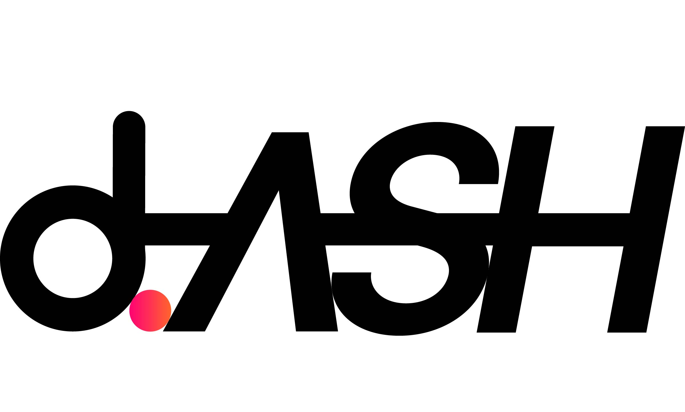

  

-----------------

## Overview
**dConstruct d.ASH SDK** is a cross-platform library for autonomous robot navigation. Use the d.ASH SDK to develop applications for your own Spot from Boston Dynamics or any other robot you wish. This section of the d.ASH SDK documentation provides details about the components of the SDK.

> :pushpin: For more information on the d.ASH SDK documentation, please refer to the [latest documentation release](https://dconstruct-admin.github.io/dash-sdk-test/).

## What’s included in the SDK:
| What | Description | Download link|
| ------- | ------- | ------- |
| **[d.ASH Server](https://dconstruct-admin.github.io/dash-sdk-test/#dash-server)** | The d.ASH server acts as the main server responsible for sending control commands to the robot. At the same time, the d.ASH server also broadcasts secured data to any given remote systems.|
| **[ROS Driver](https://dconstruct-admin.github.io/dash-sdk-test/#ros-driver)** | The ROS driver is a ROS node that has autonomy functions onboard to make your robot accessible from ROS. The ROS driver handles computational calls from any client and sends control commands to the d.ASH server. In turn, the d.ASH server relays the autonomy commands to the robot for execution.|
| **[d.ASH Autonomy Controller](https://dconstruct-admin.github.io/dash-sdk-test/#dash-autonomy-controller)** | The d.ASH autonomy controller is the GUI (graphical user interface) for the d.ASH SDK. It encompasses the interactive visual components for d.ASH's software and displays different elements for users to interact with to control your robot.|

## License
This project is licensed under the [BSD 2-Clause License](LICENSE).
Copyright 2021 dConstruct Technologies Pte Ltd.
