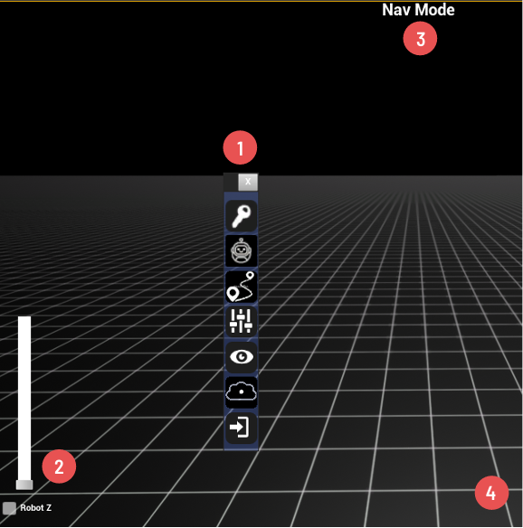

# d.ASH Autonomy Controller

As mentioned previously, the d.ASH autonomy controller is the GUI (graphical user interface) for the d.ASH SDK. It encompasses the interactive visual components for d.ASH's software and displays different elements for users to interact with to control your robot. This section of the d.ASH SDK documentation provides details about setting up the d.ASH autonomy controller, including information on its respective components.

---
### 3.1 ^^Main Components^^

<!-- {: style="width:400px"} -->

{ align=left style="width:350px"}

&nbsp;

1. ^^Main toolbar^^: Used to open other menus.
2. ^^Slider^^: Used to move floor grid up and down.
3. ^^Access mode^^: Used switch to mouse/keyboard mode.
      - ^^Navigation^^: The default mode uses the keys `WASD` to move camera and right click the mouse to zoom/tilt the camera. 
      - ^^Waypoint creation^^: Used for adding waypoints to routes.
4. ^^Floor grid^^

&nbsp;

&nbsp;

---

### 3.2 ^^Login^^

{ align=left style="width:350px"}

&nbsp;

&nbsp;

The login icon allow dConstruct users to log into the d.ASH autonomy controller using their cloud admin credentials.

&nbsp;

&nbsp;

&nbsp;

---

### 3.3 ^^Robot Connection^^

The robot connection icon allow users to connect/disconnect their respective robots to the d.ASH autonomy controller. 

{ align=left style="width:350px"}

1. ^^Online pannel^^: Select from a list of robots that are online and ready to be used to connect to.
2. ^^Connected pannel^^: Select from a list of robots that you have connected to in the client to manipulate.
3. ^^Add button^^: Press to connect to the robot selected in the online list to add the robot to the connected list.
4. ^^Minus button^^: Press to disconnect from a robot in the connected list.

&nbsp;

{ align=left style="width:350px"}

&nbsp;

&nbsp;

When users first start the d.ASH SDK, they need to give an initial estimation of the robot's post on the map by configuring its `init pose`. 

It tells the robot where its rough initial position is. To initialize `init pose`, draw the orange arrow by left clicking and drag the mouse on the floor grid.

&nbsp;

&nbsp;

&nbsp;

---

### 3.4 ^^Routes^^

The routes icon allow users to set routes for the robot to follow using waypoints. Add/remove waypoints to build your own custom routes.

#### 3.4.1 Route Controls

{ align=left style="width:350px"}

1. ^^Route name pannel^^: Enter route name to add.
2. ^^Add button^^: Click to add route of given name.
3. ^^Route selection pannel^^: Click to select a route.
4. ^^Minus button^^: Click to remove selected route.
5. ^^Waypoint button^^: Click to add waypoints to selected route.
6. ^^Load/save button^^: Load/save all routes.
7. ^^Segment pannel^^: Use keypad +/- to increment/decrement segment number.

&nbsp;

---

#### 3.4.1 Setting Up Routes

{ align=left style="width:350px"}

&nbsp;

&nbsp;

To make a selected robot follow a selected route, add waypoints by clicking on the grid. Use `WASD` and right-click on the mouse to manipulate the view.

&nbsp;

&nbsp;

&nbsp;

---

{ align=left style="width:350px"}

{: style="width:310px" }

Once the waypoints have been set, exit waypoint mode by middle clicking the mouse. On the other hand, to remove a waypoint, click on the waypoint (selected waypoint change to the color orange), and press the `delete` ket to remove.

{ align=left style="width:350px"}

&nbsp;

You can also adjust the elevation of the grid by pressing the key `ctrl` and the mouse scroll moving the floor grid in waypoint mode. A waypoint is created when you click on grid, so, to create elevated waypoints, move grid up/down and then click.

&nbsp;

&nbsp;

---

### 3.5 ^^Map Settings^^

The map settings icon allow users to adjust highpass, lowpass, UV Scale, and UV offset settings to customise the visuals of your map.

{ align=left style="width:350px"}

&nbsp;

&nbsp;

&nbsp;

1. ^^Low pass slider^^: Voxels below this value is visible. Voxels in maps have elevation, and by lowering the low pass, voxels above the low pass will be cropped.

&nbsp;

&nbsp;

&nbsp;

&nbsp;

{ align=left style="width:350px"}

&nbsp;

&nbsp;

Notice that the ceiling voxels have now been cropped by reducing the low pass.

&nbsp;

&nbsp;

&nbsp;

---

### 3.6 ^^Layer Visibility^^

{ align=left style="width:350px"}

&nbsp;

&nbsp;

&nbsp;

&nbsp;

The layer visibility icon allow users to toggle the visibility of various items on the map.

&nbsp;

&nbsp;

&nbsp;

&nbsp;

&nbsp;

---

### 3.7 ^^Load Scans^^

The load scans icon allow users to preview scans from the d.ASH Pack.

{ align=left style="width:350px"}

&nbsp;

&nbsp;

1. ^^Vox downsample size pannel^^: Select your down sample size (in metres). A large value means lower quality, but faster loading.
2. ^^Point clouds button^^: Pick loaded point clouds to toggle translucency.

&nbsp;

&nbsp;

&nbsp;

{ align=left style="width:350px"}

&nbsp;

&nbsp;

Load scans in translucent mode.
